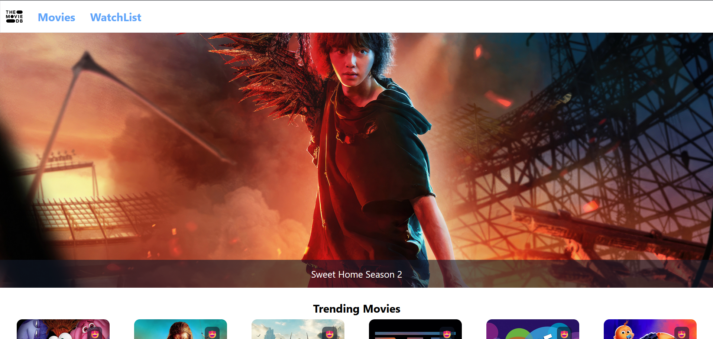
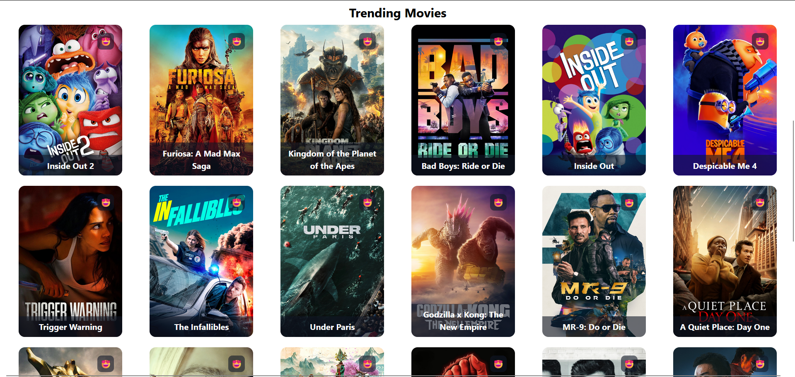
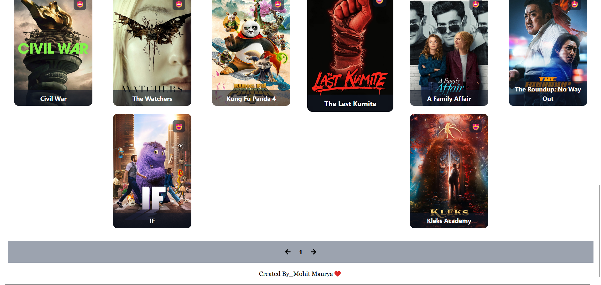
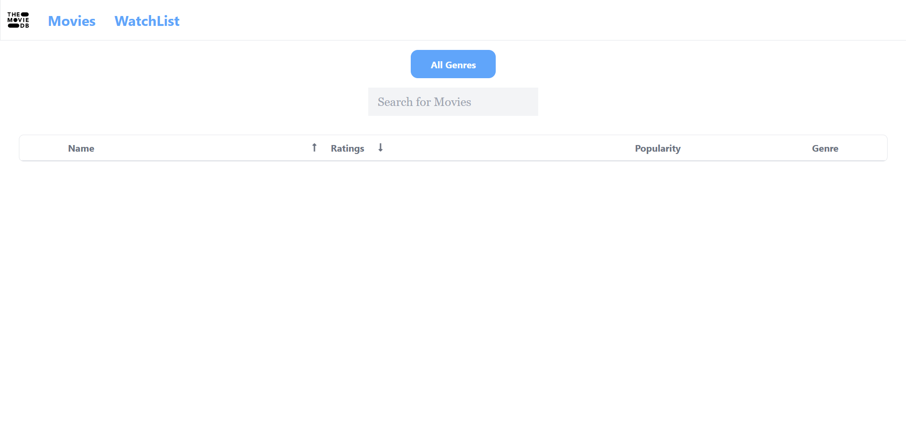
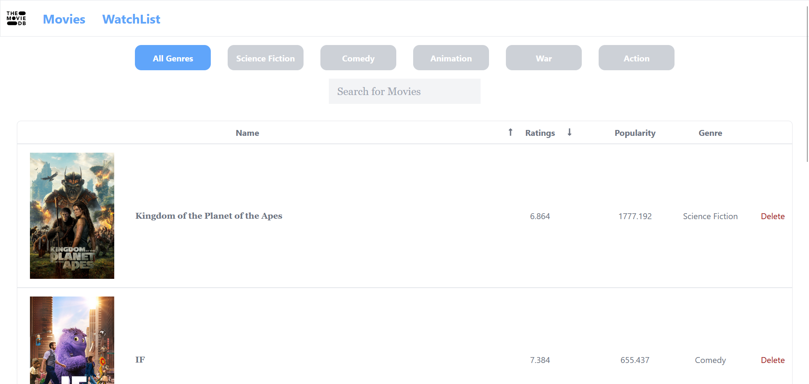

# The Movie DB

This is the Movie database project where you can see a Movie section in which the 20 movies per page are displayed. Each movie card has buttons to "add to watchlist" or "remove from watchlist". In the WatchList Movie section, you can use the "All Genre" component and the "Search For Movies" component. The table in this section has headings for "Name", "Rating", "Popularity", and "Genre". Once a movie is added, you will also see the movie poster and a delete option in the table.

## Description

The Movie DB project provides a comprehensive and user-friendly interface to browse and manage your favorite movies. Users can browse movies 20 per page and add or remove movies from their watchlist. The watchlist includes additional features like filtering by genre, searching for specific movies, and managing movie details through a table.

## Installation

Very simple to install:

1. **Clone the repository:**
   ```sh
   git clone https://github.com/yourusername/the-movie-db.git
   ```
2. **Navigate to the project directory:**
   ```sh
   cd the-movie-db
   ```
3. **Install the dependencies:**
   ```sh
   npm install
   ```
4. **Install Tailwind CSS:**
   Follow the instructions on the [Tailwind CSS website](https://tailwindcss.com/docs/installation).

5. **Install React Icons:**
   ```sh
   npm install react-icons --save
   ```
6. **Install React Router DOM:**
   ```sh
   npm install react-router-dom@6
   ```
7. **Set up TMDB API Key:**
   - Create an account on the [TMDB Developer website](https://developer.themoviedb.org/reference/intro/getting-started).
   - After creating an account, go to [The Movie DB website](https://www.themoviedb.org/), click on the "More" option, then select "API" to create your API key.
   - Add your API key in the `Movies.js` component:
   ```javascript
   useEffect(() => {
     axios.get(
       "https://api.themoviedb.org/3/movie/popular?api_key=<Your API KEY>&language=en-US&page=1"
     );
   });
   ```
8. **Run the project:**
   ```sh
   npm run start
   ```

## Usage

1. **Browse Movies:**

   - Navigate through the movie section to see 20 movies per page.
   - Each movie card has buttons to "add to watchlist" or "remove from watchlist".

2. **Manage Watchlist:**
   - Use the "All Genre" component to filter movies by genre.
   - Use the "Search For Movies" component to search for specific movies.
   - View the table with columns for "Name", "Rating", "Popularity", and "Genre".
   - Once a movie is added to the watchlist, view additional details such as the movie poster and a delete option.

## Preview of the Project







## Contributing

Feel free to contribute to this project. Any improvements or suggestions are welcome!

## License

This project is open-source and available under the [MIT License](LICENSE).

## Contact Information

If you have any questions or need further information, feel free to contact me at mauryamohit138@gmail.com.
